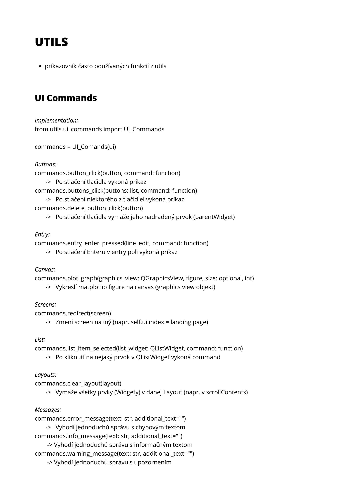

# Information system of the E-shop

[Zadanie](assets/docs/zadanie.pdf)
 
 
## Git commands

#### Working with branches
- Create new branch `git checkout -b new-branch-name`
- Display current branch `git branch` 
- Change branch `git checkout branch-name`

#### Making changes 
1. Take recent code from Github `git pull`
3. Make changes to the code
4. Stage changes `git add .`
5. Commit changes `git commit -am "Describe what has been changed"`
6. Push your changes to the Github `git push`

## Theme

Colors: [Palette](https://coolors.co/palette/cad2c5-84a98c-52796f-354f52-2f3e46)
- white: #f8f8f8
- ash-gray: #cad2c5
- dark-sea-green: #84a98c
- hookers-green: #52796f
- dark-slate-gray: #354f52
- charcoal: #2f3e46
- black: #000000

Font: 
- primary: Default font (MS Shell Dlg 2, Bold)
- secondary: Myanmar Text, Bold (Normal-size: 10px, Heading: 15px)

## Commands and utils sheet

## Module structure and datafile format

## Downloading and initializing git

1. [Download git](https://git-scm.com/) and follow installation guide
2. In your local project folder open [command prompt](https://www.youtube.com/watch?v=bgSSJQolR0E)
3. Enter command `git config --global user.name "your github username"`
4. Next enter `git config --global user.email "your e-mail"`
5. Clone this repository `git clone https://github.com/tomas-magat/camels-eshop-infosystem.git`

## Installing PyQt5 and Qt Designer

1. Install PyQt5  `pip install -r requirements.txt`
2. [Download](https://build-system.fman.io/qt-designer-download) and install Qt designer (tool)  

- [PyQt5 tutorial](https://www.pythonguis.com/pyqt5-tutorial/)
- [Qt Designer manual](https://doc.qt.io/archives/qt-4.8/designer-manual.html)

## Basic Workflow

#### Creating module interface in QtDesigner
1. In Qt Designer open file `source\code\main.ui`
2. Using object inspector on the right side of Qt Designer click on your module screen
3. Define layout (using containers, frames, widgets and layouts)
4. Add elements to the frames (PushButtons, Labels...)
5. Change element properties (using property editor in the right side of Qt Designer) 
6. Customize the stylesheet of the element (Using [CSS Properties](https://www.youtube.com/watch?v=508C8dX9_og))
7. In case of need to create python custom widget run `pyuic5 -x main.ui -o main.py`

#### Changing the window behaviour (button press...)
1. Open `source\code\modules\[your_module].py`
2. Using `ui_commands.py` module assign command to element (button_clicked()...)
3. Test the changes by running `app.pyw`

## Filemap

