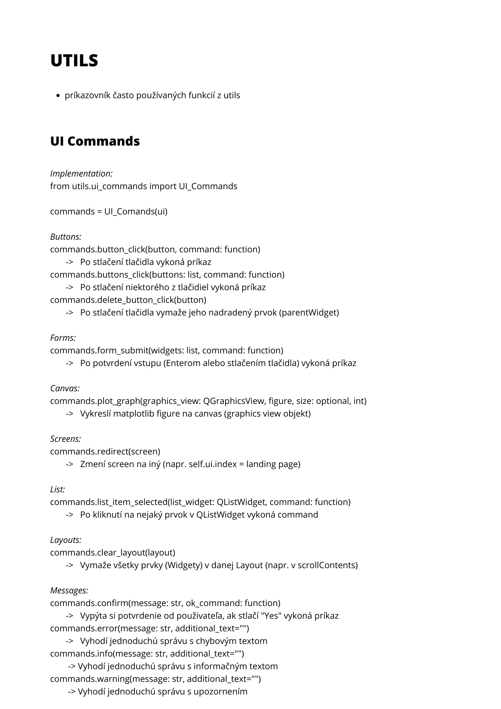
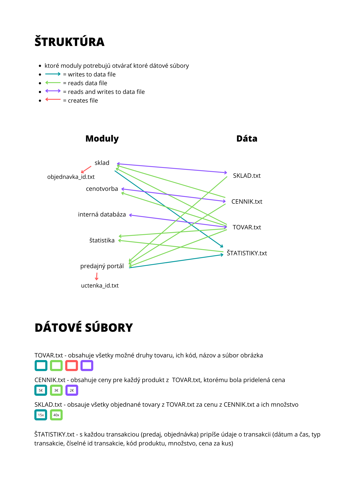

# Information system of the E-shop

[Zadanie](assets/docs/zadanie.pdf)

## Git commands

#### Working with branches
- Create new branch `git checkout -b new-branch-name`
- Display current branch `git branch` 
- Change branch `git checkout branch-name`

#### Making changes 
1. Take recent code from Github `git pull`
2. Make changes to the code
3. Stage changes `git add .`
4. Commit changes `git commit -am "Describe what has been changed"`
5. Push your changes to the Github `git push`

## Theme

Colors: [Palette](https://coolors.co/palette/cad2c5-84a98c-52796f-354f52-2f3e46)
Font: Default font - MS Shell Dlg 2, Bold; Myanmar Text, Bold

## Commands and utils sheet

## Module structure and datafile format

## Setting up

1. Clone this repository `git clone https://github.com/tomas-magat/camels-eshop-infosystem.git`
2. Install requirements  `pip install -r requirements.txt`
3. Run the main file `source/code/app.pyw`

## PyQt5 commands

- Create python file from main.ui `pyuic5 -x main.ui -o main.py`
