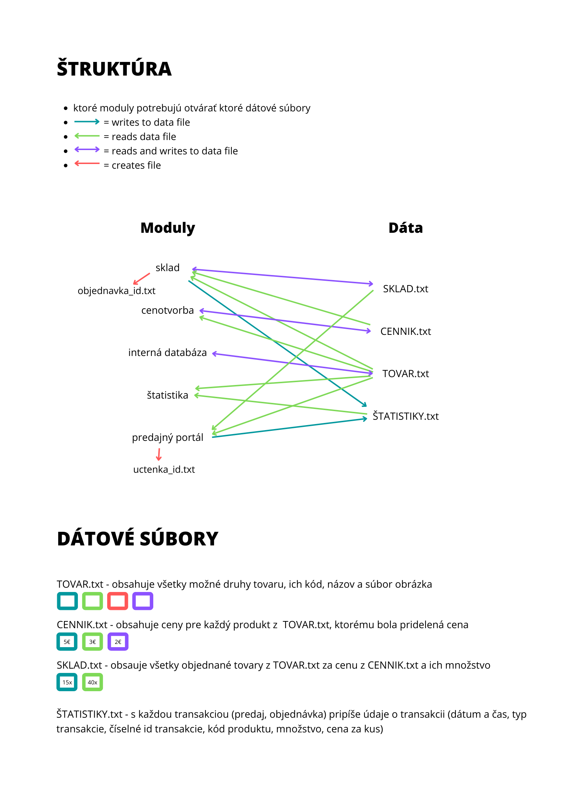
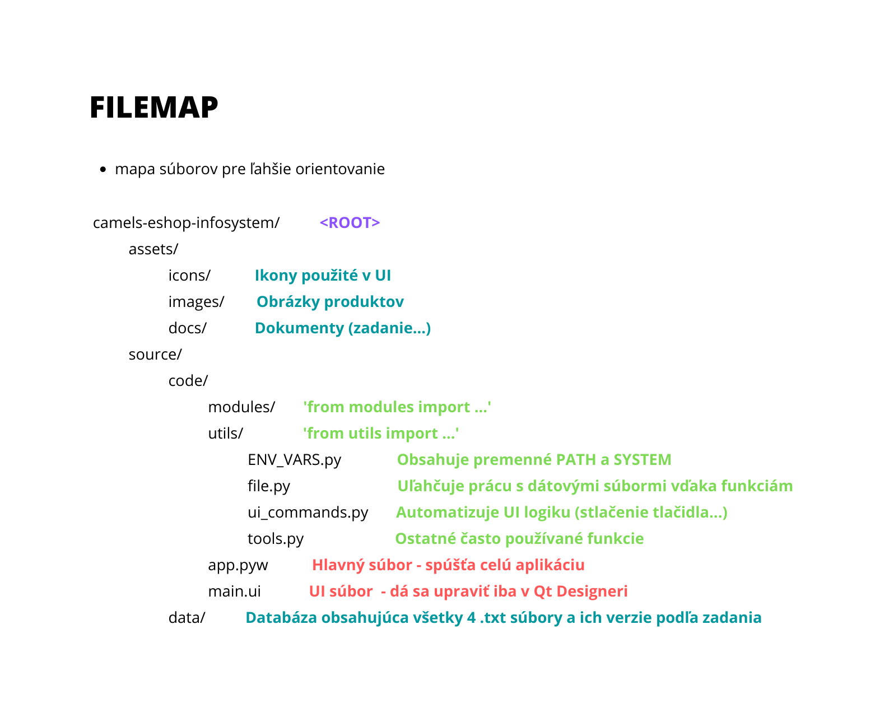

# Information system of the E-shop

[Zadanie](assets/docs/zadanie.pdf)

## Downloading and intializing git

1. [Download git](https://git-scm.com/) and follow installation guide
2. In your local project folder open [command prompt](https://www.youtube.com/watch?v=bgSSJQolR0E)
3. Enter command `git config --global user.name "your github username"`
4. Next enter `git config --global user.email "your e-mail"`
5. Clone this repository `git clone https://github.com/tomas-magat/camels-eshop-infosystem.git`
 
## Working with git

*Follow these steps:*

#### Create new branch for new changes (in your terminal)
1. Take recent code from Github `git pull`
2. Create branch `git checkout -b name-of-the-new-branch`

#### Making changes (repeat these steps until you're finished with changing the code)
3. Make changes to the code
4. Stage changes `git add .`
5. Commit changes `git commit -am "Describe what has been changed"`

#### Publishing changes on Github
6. Push your changes to the Github `git push --set-upstream origin name-of-the-branch-you-created`
> On the github website:
7. Click 'compare & pull request' button that appeared on the top of the github page
8. Click 'create pull request' button
9. Click 'merge pull request' button on the following page
10. Click 'confirm merge' and 'delete old branch' buttons
> In your terminal:
11. Switch to the main branch `git checkout main`
12. Sync your code with github `git pull`

## Installing PyQt5 and Qt Designer

1. Install PyQt5  `pip install -r requirements.txt`
2. [Download](https://build-system.fman.io/qt-designer-download) and install Qt designer (tool)  

- [PyQt5 tutorial](https://www.pythonguis.com/pyqt5-tutorial/)
- [Qt Designer tutorial](https://doc.qt.io/archives/qt-4.8/designer-manual.html)

## Basic Workflow

#### Creating module interface in QtDesigner
1. In Qt Designer open file `source\code\main.ui`
2. Using object inspector on the right side of Qt Designer click on your module screen
3. Define layout (using containers, frames, widgets and layouts)
4. Add elements to the frames (PushButtons, Labels...)
5. Change element properties (using property editor in the right side of Qt Designer) 
6. Customize the stylesheet of the element (CSS)

## Changing the window behaviour (button press...)
1. Open `source\code\modules\[your_module].py`
2. Using `ui_commands.py` module assign command to element (button_clicked()...)
3. Test the changes by running `app.pyw`

## Module structure and datafile format

